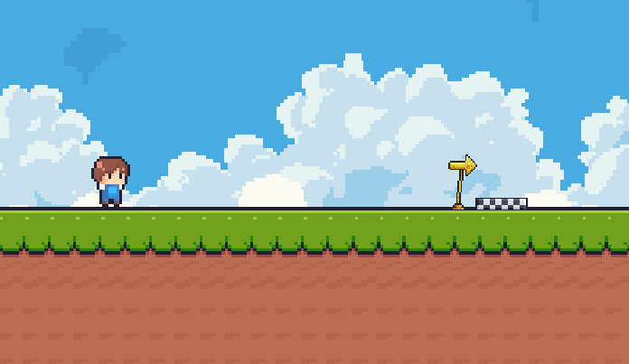

# Platform Game 2D

 
 

This game is part of a personal game development project for a startup competition. Adapted so that I can evaluate and develop my programming skills. This is not a professional project, just made to explore and evolve in the world of development.

    

## About
The game is a simple platform game 2D, located on the high reliefs near the clouds. The player is a humble farmer who needs to collect all the fruits scattered around the field, and reach the end with them.

## Features
#### Unity version: `2022.3.32f1`
#### Used assets: 

    <a href="https://assetstore.unity.com/packages/2d/characters/pixel-adventure-1-155360?srsltid=AfmBOoreM-kGE2yuTPTNQJNefZcZku71ADaQuP094eXEFbCBRdZ_4kvN" target="_blank">Pixel Adventure 1</a>
    <a target="_blank" href="https://assetstore.unity.com/packages/2d/undead-survivor-assets-pack-238068?srsltid=AfmBOoolkSh9Fiz22GrA1UOiZhKqRQoizyI6itsA8DY_CaNSLDE5_jt6">Undead Survivor</a>
    <a target="_blank" href="https://assetstore.unity.com/packages/2d/gui/icons/game-input-controller-icons-free-285953">Game Input Controller Icons</a>
    <a target="_blank" href="https://assetstore.unity.com/packages/2d/environments/pixel-skies-demo-background-pack-226622?srsltid=AfmBOoo58gXlFWfZHRSr4kFIrporqAmOt5FQt8u5fOuAPe_yxLKoOWbx">Pixel Skies</a>

 

## Upcoming
This game is still incomplete, but it will soon receive an update with new levels, features and a much more engaging dynamic. Stay tuned!

#### This game is still incomplete, but it will soon receive an update with new levels, features and a much more engaging dynamic.

